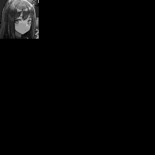

## Description
ASCII-to-Image is a program built in a Jupyter Notebook that takes an ASCII File of an anime girl and converts it into a colored image. The program takes 64x64 ASCII images saved in a standard .txt file in the "input-txts" folder, the program utilizes trained pytorch models saved in the "models" folder, and the program saves the outputted augmented ASCII .txt files in the "output-imgs" folder.
## Prerequisites
- Python 3.6 or higher
- Jupyter Notebook
- Pillow
- Numpy
- Torch
- Torchvision

All the correct versions of the libraries above apart from Python and Jupyter Notebook can be installed using the command below:

`pip install -r requirements.txt`
## Process
The program can take almost any text file as long as it is 64x64 and saved as a .txt file, but compatible ASCII art is best created within the [Image-to-ASCII](https://github.com/0023jas/Image-to-ASCII) program that I also created. This ASCII art is first decoded into a 64x64 image where the weight of each character correlates to the darkness of each pixel. After the 64x64 black and white image is created, this image is then upscaled to be 256x256. This image is then smoothed and coloured using two neural networks trained using the [Pytorch-CycleGAN-and-pix2pix](https://github.com/junyanz/pytorch-CycleGAN-and-pix2pix) repository found on GitHub.

The full conversion process from a small rough image to a full colored image is ✨magical✨

## Training
The training process consists of using the [Pytorch-CycleGAN-and-pix2pix](https://github.com/junyanz/pytorch-CycleGAN-and-pix2pix) repository alongside a modified version of that same repository that only works with black and white images. The black and white version of that repository is used to create the model that takes an image from pixelated to a smooth image. The standard version of the repository takes this black and white image and outputs a colored image. 
### Downloading the Repository
The repository can be downloaded

`git clone https://github.com/junyanz/pytorch-CycleGAN-and-pix2pix.git`

renamed 

`mv pytorch-CycleGAN-and-pix2pix pytorch-CycleGAN-and-pix2pix-bw`

and the project should be downloaded once more.
### Editing the Black and White Repository
In the black and white repository go to the "options" folder, and open the file named "base_options.py" in a text editor. 

The two lines

`parser.add_argument('--input_nc', type=int, default=3, help='# of input image channels: 3 for RGB and 1 for grayscale')`

`parser.add_argument('--output_nc', type=int, default=3, help='# of output image channels: 3 for RGB and 1 for grayscale')`

need to be changed to

`parser.add_argument('--input_nc', type=int, default=1, help='# of input image channels: 3 for RGB and 1 for grayscale')`

`parser.add_argument('--output_nc', type=int, default=1, help='# of output image channels: 3 for RGB and 1 for grayscale')`

so the program understands that it will be training and outputting grayscale images. 
### Creating the Datasets
The datasets for training the model consist of four folders:
- trainA
- testA
- trainB
- testB

The "A" folders consist of images that the model can expect as input, the "B" folders consist of images that the user will expect as output. Generally, 80-90% of the input images should be in trainA and 20-10% of input images should be in testA. The same is true for output images in the "B" folders. These four folders should be put into an encompassing folder with a logical name and put in the "datasets" directory of the "pytorch-CycleGAN-and-pix2pix-bw" repository. 
### Training a Model
After installing all the necessary dependencies which likely includes CUDA or WSL, the program can be run using a command along the lines of what is featured below

`python3 train.py --dataroot ./datasets/animeg --name animeg-cyclegan --model cycle_gan --save_epoch_freq 5`

Broken down example command to train AI:
- python3 (Using Python3)
- train.py (Uses this specific python file to train the AI)
- dataroot ./datasets/animeg-color (Specifies the name and location of the dataset)
- name animeg-cyclegan (Specifies the name of the model that will be saved)
- model cycle_gan (Specifies what model to use to train the Neural Network)
- save_epoch_freq 5 (Specificies how frequently the model should be saved)

A common error I ran into was the following

`Could not load library libcudnn_cnn_infer.so.8. Error: libcuda.so: cannot open shared object file: No such file or directory`

This can be solved with the following bash command

`export LD_LIBRARY_PATH=/usr/lib/wsl/lib:$LD_LIBRARY_PATH`
### Monitoring the Training
To monitor the training progress of the neural network it's possible to run an application called visdom by first installing

`pip install visdom`

and then running

`python3 -m visdom.server -port 8097`
### Training the Second Model
Training the color model works the same as the black and white model, but I used the output of the black and white model as the "A" dataset so the neural network has a closer understanding of what the input image will be. This is also done in the unedited repository not the black and white repository. 
### Using Trained Models
The trained models can be found in the "checkpoints" folder under the name the model was given. The best model can then be moved into the "models" folder and should be given the names:
- bw-smoothing-model.pth
- color-model.pth

The featured models only upscale ASCII art of anime girl faces, but this technology could most likely be used to upscale most ASCII art of uniform size. All that is needed is a large enough folder of images (recommend 1000 for both "A" and "B" folders), and enough GPU time (I used a gtx1070 for roughly 36 hours on both models).

